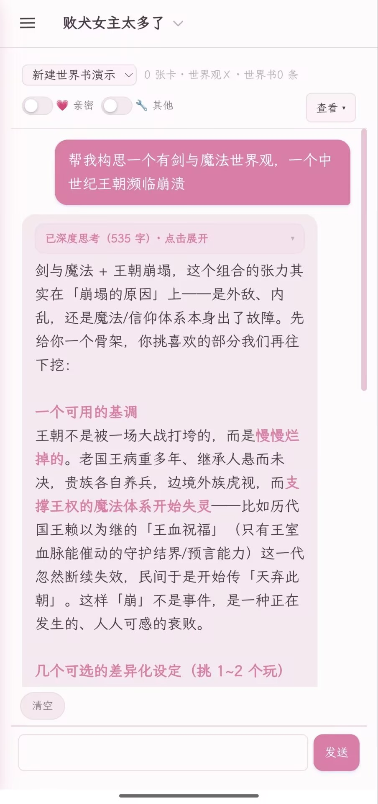
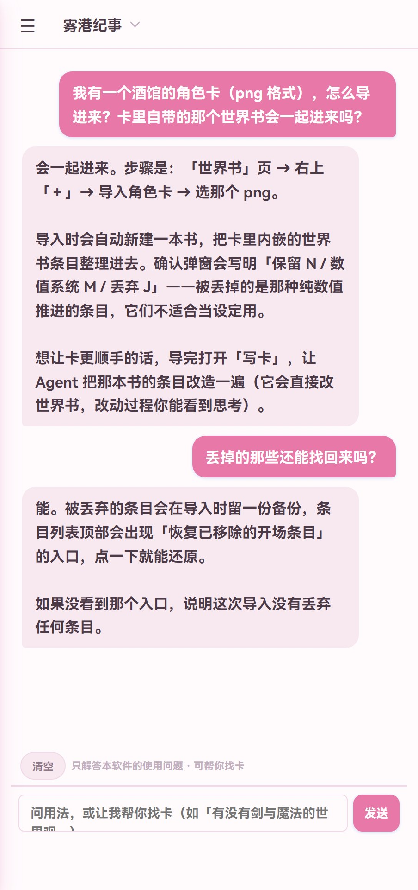
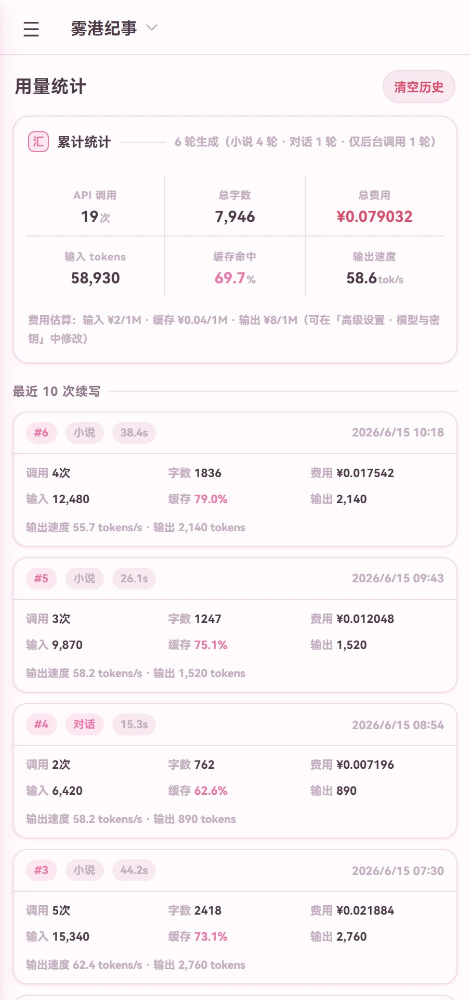
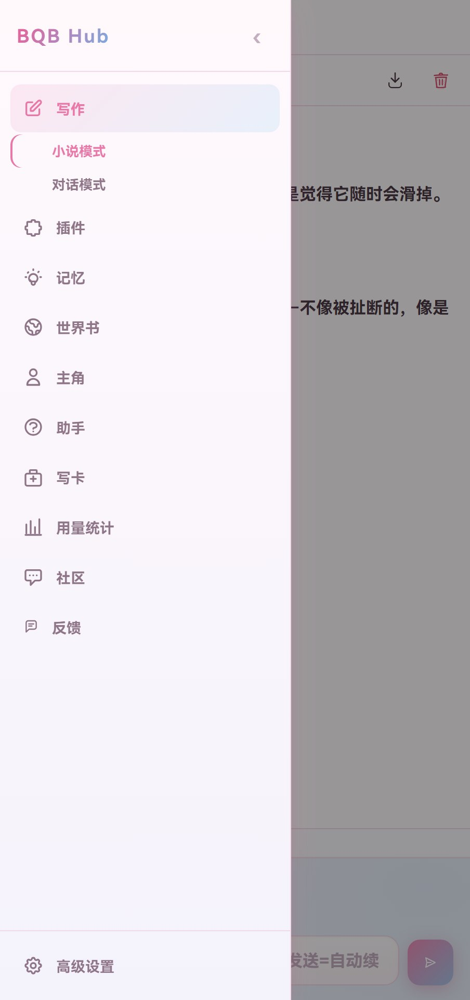

<div align="center">

# BQB Hub

**为中文轻小说写作做的 Android App**
AI 帮你续写 · 长篇不丢设定 · 边写边改随时回滚

不用折腾酒馆（SillyTavern）那一整套配置：装上、填个模型 API、直接开写；
手上的酒馆卡也能一键导入，由内置的写卡 Agent 帮你改造成适配卡。

[**⬇️ 下载最新版 APK（1.5.99）**](http://43.155.128.242:8899/apk/novel-writer-160.apk)

`Android 5.0+` · `免费开源（MIT）` · `数据存在本机`

</div>

---

## 📱 界面预览

<table>
<tr>
<td align="center" width="33%"><br><sub><b>世界书</b>：书架式管理，条目分世界观 / 角色 / 初始 / 其他</sub></td>
<td align="center" width="33%"><br><sub><b>写卡 Agent</b>：和它讨论，它直接改世界书（思考过程可展开，不进正文）</sub></td>
<td align="center" width="33%"><br><sub><b>使用助手</b>：内置客服，也讲清酒馆卡怎么导入与改造</sub></td>
</tr>
<tr>
<td align="center" width="33%"><br><sub><b>用量统计</b>：每轮的字数、费用、缓存命中与输出速度都记着</sub></td>
<td align="center" width="33%"><br><sub><b>功能一览</b>：写作 / 记忆 / 世界书 / 写卡 / 社区 / 反馈</sub></td>
<td align="center" width="33%"></td>
</tr>
</table>

---

## 📥 下载与安装

| 渠道 | 地址 | 说明 |
|---|---|---|
| **官方直链（推荐）** | **[http://43.155.128.242:8899/apk/novel-writer-160.apk](http://43.155.128.242:8899/apk/novel-writer-160.apk)** | 点开就下，可以直接分享给别人 |
| App 内更新 | 打开 App →「我的」→ 检查更新 | 启动时也会自动检查；下载后覆盖安装 |
| 发行版附件（Release） | [最新发布](../../releases/latest) | 同一安装包的镜像附件（在代码托管平台的 Release / 发行版里下载） |

**安装三步**：① 下载 APK → ② 点开安装（首次会提示"允许安装未知来源应用"，按提示打开即可）→ ③ 打开 App，在「高级设置 → 模型与密钥」填入你自己的大模型 API（DeepSeek、豆包、Kimi、OpenAI、OpenRouter、本地 Ollama / LM Studio 等任何 OpenAI 兼容接口都行）。

> 三个渠道的安装包**签名一致**，可以互相覆盖安装；只有卸载重装才会清掉本机数据（正文存在手机本地，换机请先用「备份」导出）。升级不会丢正文、设定与记录。

---

## ✨ 这是什么

BQB Hub 是给中文轻小说作者做的 Android 写作 App：**AI 负责续写，你负责故事**。

它和"套个聊天框"的 AI 写作不一样，力气花在长篇最难的地方——**记忆**。世界书、记忆数据库与归档检索会在写到几十万字后，仍然把早期的设定、伏笔和人物关系找回来接着写，而不是越写越忘；想改设定时，AI 只动一层**临时世界书**，原书一个字不变，不满意一键回滚。也不用折腾酒馆那套正则、注入位置和变量系统：填上任意 OpenAI 兼容接口（DeepSeek / Kimi / GLM / 本地 Ollama 都行）就能开写，手上的酒馆角色卡与预设可一键导入、由内置写卡 Agent 改造成适配卡。

一个**手机上的中文轻小说写作工具**，把「AI 续写」和「长篇写作的记忆管理」做在了一起：

- 你在正文里写下去，AI 接着你的风格续写；
- 写到几十万字，早期的设定、伏笔、人物关系不会丢——内置记忆系统会把旧正文与设定找回来喂给模型；
- 想改设定？直接和 App 里的 AI 助手讨论，它改的是**叠在原设定之上的临时层**，原书一个字不动，不满意随时回滚；
- 写得好可以分享到社区：世界书、预设一键上传与下载，别人写好的设定你导入就能用。

**面向的正是这样的人**：想安安静静写小说，但被酒馆那套（正则、世界书条目、注入位置、变量系统）劝退；或者已经在酒馆写过，想把角色卡和设定搬过来继续写。

---

## 🚀 核心功能

### ✍️ 写作台
- 底部输入框写指令（如"她推门而入"），回车即续写；**留空发送 = 自动续写**。
- 章节管理、一键撤回上一段、隐形思考框（模型想什么你看得见，但不会混进正文）。
- 正文长度自己定：「记忆 → 正文窗口（字）」决定每次续写带多少正文进去（默认 5 万字）；导出 TXT / 整机备份随时可用。

### 🎬 真实模式（多角色各自独立记忆）
同一本书的第三个视图：**一轮只有一个人说话**，每个角色的内心与记忆**各自独立维护**——TA 不在场时发生的事，TA 真的不知道（那部分内容根本不会发给 TA，不是靠提示词"请别说"）。点「▶ 继续」就能开局（时间、地点、在场由「场记」自己维护）；输入框上方的下拉可以随时切「上帝模式」（不发言、只推进剧情）或任意已加入的角色：你随手写的那句会先被 **AI 转述**成这个角色规范的一轮（台词、动作、心里话分清，只整理、不改意思）——**只有整理出来的那部分才会被别的角色看到**；低声说话只有对方听得到（旁人只看到一句"两人在低声交谈"），心里话只有你看得到。旁边的 **「让 TA 接话」** 下拉可以点名这一轮由谁接话（默认「（自动）」由场记挑，选完一轮自动回到「（自动）」；撤回上一轮会把那次点名一并放回来）。谁知道什么按"多少人知道"分四层：**角色条目**＝公开人设（人人知道）、**初始记忆**＝只有一个人知道、**部分人知道**＝一个小组知道（列出知情者，名单外的人连内容都拿不到）、**大家都知道的事**＝场记自动维护的公开通知/传闻（不在场也知道）。角色之间的信息差因此一直保持下去。

### 🧠 记忆系统（BM25 高召回，本地免费）
长篇写作的核心难点是"模型只记得住最近几万字"。这里的做法是：
- 超出窗口的旧正文**自动滚入归档区**，原文不丢；
- 需要时用 **BM25 关键词检索**把相关旧文段召回（完全在手机本地计算，不额外花 API 费用）；
- 另有**记忆数据库**（剧情摘要、角色档案、物品追踪、世界设定）与**角色状态**，按正文里出现的实体自动激活注入——不用手动登记，也不会因为"太久没提到"而失忆。

### 🎭 写卡 Agent（内置）
把"做角色卡"变成对话：
- 直接说"我想做一个新角色：……"，它会从零引导你讨论，把结论**通过工具直接写进世界书**（讨论中的想法只作备忘，拍板后才落库）；
- **酒馆卡迁移**：导入酒馆角色卡后，说一句"把这张酒馆卡改造成适配卡"，它会读卡内世界书的原文、给出扫描报告（哪些保留 / 哪些是酒馆系统残留该丢 / 哪些需要你拍板），你逐条回"保留、丢掉、改成角色"，它即时写入并在写入后**自己复查一遍**；好感度这类数值系统会被改写成大白话设定（"好感度 87"→"好感颇深"）。

### 🐟 比奇 & Agent 设定同步（写作中动态维护设定）
- **比奇**：正文页工具栏点开，和它讨论"剧情接下来怎么走"，它会直接维护一本书的**临时世界书**——改条目、停用、新增，立即生效；原书零触碰，改动打包成批次，随时**一键回滚**。它能看到当前设定与最近正文，所以讨论不会跑偏。配好画图主机后，说一句「画一张……」它就会按最近上下文**直接出图**（不再反问），图贴在对话里；也可以先和它讨论画面。
- **Agent 设定同步**：不打断你的写作，在续写时自动发现剧情里的设定变化，整理成提案写进临时世界书（best-effort，不会污染正文）。
- 两者都只改临时层（同一份数据，因此同时只能开一个）；确认满意再"结算"进原书。

### 📚 世界书 / 数据库 / 主角
- **世界书**：书架式管理，条目分「世界观 / 角色 / 初始 / 其他」，每条有注入开关（关掉就不进模型）；「初始」条目在正文为空时注入一次，负责开局设定。
- **数据库**：自建表格记录设定，可按时间线查看；「回溯填表」让 AI 从正文里把内容补齐，你确认后保存。
- **主角**：可以建多个主角，选中一位作为当前视角。

### 🌐 社区（世界书 / 预设分享）
- 浏览、下载别人分享的世界书与预设，**不导入也能先看全部条目**；
- 点赞、评论、按「最新 / 热门 / 活跃」排序；
- 上传自己写的设定：上传后先进入「待审核」，管理员通过后对所有人可见（审核状态在「我的」里看得到，也可以自己删）。
- 想找卡但不知道关键词？直接在「使用助手」里说"有没有校园剑道题材的"，它会检索社区、给出推荐并**一键导入**。

### 🤖 全能助手
「使用助手」页是个内置客服：软件怎么用、某个页面做什么、怎么设置，直接问；它还兼任**社区找卡员**（上面那条）。

### 🧩 插件（内置，随版本更新）
- **经典记忆数据库**：自动整理剧情摘要 / 角色档案 / 物品追踪 / 世界设定；
- **Agent 设定同步**、**比奇**：见上。

---

## 🍺 从酒馆（SillyTavern）过来

| 你手上的东西 | 怎么用 |
|---|---|
| 酒馆**角色卡**（.png，含内嵌世界书） | 「世界书」页 → 右上「＋ → 导入角色卡」→ 选文件。会自动新建一本书，把卡里的世界书条目整理进去（确认弹窗会写明"保留 N / 数值系统 M / 丢弃 J"）。想要更顺手，就打开「写卡」让 Agent 改造一遍。 |
| 酒馆**世界书**（JSON） | 直接贴给「写卡」的 Agent，说"改成适配本软件的版本"，它会给报告并帮你落库。 |
| 酒馆**预设** | 支持导入预设（系统提示词 / 正则规则），在「高级设置 → 预设」里管理；条目与格式说明见 [预设格式说明](docs/预设格式说明.md)。 |

更细的操作说明（逐页图解式）见 [功能使用文档](docs/功能使用文档.md)；App 内也有「使用助手」随时答疑。

---

## ❓ 常见问题

**要用哪个模型？花不花钱？**
App 本身免费，模型费用由你自己的 API 账号结算。省钱可以在「高级设置」里挑便宜的模型，或用本地模型（Ollama / LM Studio，局域网直连）。

**我的小说会不会被上传？**
不会。正文、设定、记忆都存在手机本地；只有你主动使用社区（上传 / 下载 / 点赞评论 / 找卡）时才联网，且上传内容会先进入审核。

**换手机怎么办？**
在「高级设置」里用「备份」导出整机数据，在新手机导入即可；正文也可单独导出 TXT。

**升级会不会丢数据？**
不会。三个下载渠道的安装包签名一致，覆盖安装即可，正文 / 设定 / 记录都保留。

**为什么审核要等？**
社区的上传内容由运营者审核后才公开，这是为了让分享区保持干净；你自己的稿子在「我的」里随时可见、可删。

---

## 🛠 技术信息

<details>
<summary>给开发者 / 想自己部署的人（点开）</summary>

**技术栈**：TypeScript + Vite + Capacitor（Android）；服务端 Node.js + Express + SQLite。
**数据**：全部本机存储（IndexedDB，localStorage 降级）——不需要账号也能写作，登录只用于社区。
**服务端**：`server/`，Express + node:sqlite，含账号 / 世界书 / 预设 / 插件 / 点赞评论 / 上传审核 / 版本分发。

**目录结构**

```
app/           前端 TS 工程（源码 src/、测试 tests/、构建脚本 scripts/）
web/           App 前端本体：页面外壳 index.html + 字体 + 构建产物 modules/main.js
               （Capacitor 的 webDir，`npx cap copy` 把整个目录拷进 APK）
android/       Android 工程（Capacitor）
server/src/    社区服务端（Express + SQLite）
docs/          架构、ADR、功能与格式文档
```

**常用命令**

```bash
# 服务端（本地开发，默认 8899）
cd server && npm install && npm start

# 前端测试 / 类型检查 / lint（改 app/src 后必须跑）
cd app && npm test && npm run typecheck && npx eslint src tests

# 前端模块构建（改 TS 源码后必须执行；全新克隆也必须先执行）
cd app && npm run sync:legacy

# 版本发布（单一来源 android/app/build.gradle；同步 web/version.json、android assets、server/app-version.json）
node scripts/bump-version.mjs 1.5.92

# Android 出包
cd android && ./gradlew assembleDebug
```

**版本与发版**
- 当前版本 **1.5.99（versionCode 160）**，见 [web/version.json](web/version.json)；版本号单一来源 `android/app/build.gradle`。
- 发布链路：本地 `gradlew assembleDebug` → 上传服务器 → 三方 md5 校验 → 版本接口验证 → 推送 `main`（**Gitee + GitHub 双远端**，两边都比对 `ls-remote`）；只改界面与写作逻辑的改动走网页包热更新（免装包）。主机地址与逐条命令见本地文档（不入库）。
- 近期改动（v1.5.86 – v1.5.99）：
  - **比奇也能出图了（热更新 1.5.99.45）**：正文页的比奇窗、对话模式的比奇窗都能画图了——直接说一句「画一张：放学后的空教室，她靠窗坐着」，**它不回反问，按最近的上下文（世界书里的人物 + 最近正文/演出记录）直接出图**，图就贴在对话里（点开可看大图，下面标着尺寸/seed/耗时）；也可以先和它**讨论画什么**，聊完说「就画这个」它再画。想更快说「快一点」，想挑构图说「出两张草稿」，要更大更细说「更精细」。和写卡那边一样需要先在「设置 → AI 与生成 → 画图主机」配好地址和配对 token；没配好时它**不会**提议"要不要我画一张"，也不会假装画了。
  - **写卡 Agent 能直接出图了（热更新 1.5.99.39）**：在「设置 → AI 与生成 → 画图主机」填上你电脑上的画图主机地址和配对 token，写卡时就能让 AI 给你电脑上的 ComfyUI 派活——**它先问你要不要画，你同意才画**（默认头像 768×768、28 步，约 15 秒；细节多的图也能站得住）；图直接显示在对话里（点开可看大图），**你说「用这张」它才会把图设成某个角色的头像**（自动压到 512 存进世界书，世界书 / 对话 / 真实模式的头像会立刻一起刷新）。同一个角色想画得像，可以让它沿用上一张的 seed；想挑构图用草稿（512×512，更快）。只在画图主机**在线**时才把它交给 AI；没配 / 没开时它会如实说明，不会假装画了。生成的原图只在本会话内可见（不占存储），设成头像的那张才是永久的。画图主机是自建/进阶用法（把本机 ComfyUI 包一层的小服务，地址与 token 由它打印）。
  - **更新生效更利索（热更新）**：修掉"新版本其实装好了、却提示要重启，点「检查更新」还会白闪一下"的一串问题——启动时如果发现"装好了但没换上"会当场换上；已经在跑最新版的会话不会再误弹"现在重启界面立即生效"，也不会重复切换。以后打开 App 就是新版，不用再重启或手动点一次。
  - **真实模式：可以点名让某个角色接话（热更新）**：输入框上方新增 **「让 TA 接话」** 下拉（和「以谁的身份说话」同一行）——默认「（自动）」仍由场记挑；选一个人，这一轮就由 TA 接话（候选＝此刻在场的人），**走完一轮自动回到「（自动）」**，撤回上一轮会把那次点名一并放回来（重来还是 TA）。
  - **启动少一次等待、清空更干净（热更新）**：启动时与版本检查同时预取网页包信息（少一次往返）；真实模式与对话模式发送后输入框高度会回落；「清空本书」现在把输入栏里还没发出去的字也一起清掉（生成中点清空会先停住本轮，不会再往刚清干净的记录里补写）。
  - **对话模式的台词显示更清楚（v1.5.99）**：说出口的话一律用「」包住、其他内容不加引号，软件严格按引号分色——旁白不会再被染成台词色，台词也不会被当成动作显示成淡色；提示词里把这条写成了硬要求（含「嗯。」这类单字回应、心声不加引号）并让 AI 输出前自检。
  - **写卡与世界书完全同步（v1.5.99）**：两边维护的是同一本书——在世界书页改了内容或删了条目，写卡这边立刻跟着变（反向同样即时生效），不会再出现"一边改了、另一边还是旧内容，下一次写入还把改动覆盖回去"。
  - **写卡：长按更好按、可以选一段复制（v1.5.99）**：长按阈值放宽到约 0.8 秒、滑动不再误触复制条；长按气泡后可拖动手柄**选中一段**再点浮条的「复制」，系统自带的复制菜单不再和浮条一起冒出来。
  - **写卡按「轮」分工（v1.5.99）**：设计阶段（提问、构思、让它出方案）只输出设计、不动世界书、一轮说完；你说「写入吧 / 就这样 / 按这个改 / 继续」它才提交，写入即生效——不再有「讨论中未写入」这类中间状态与标记。
  - **更新生效更可靠（v1.5.98）**：热更新装好后如果当时正在用 App，会直接问一句「现在重启界面立即生效？」（选「取消」也不耽误，切出去再回来照样自动换上）；切回 App 时发现新版本的等待也从最长十分钟缩短到一分钟；刚装完新安装包后的第一次热更新不再需要退出重开。
  - **意见反馈（热更新 + 服务端更新）**：侧边栏在「社区」下面新增 **反馈** 页——匿名给管理员提意见，最多 300 字（到上限会提示"可以再发一条"），提交成功会感谢你，管理员在「管理」页的**意见反馈**里按 未查看 / 已查看 / 全部 查看、逐条或全部标记已读、也能删除。频率限制：**每分钟最多 2 条**（防误触发连点）；单条 300 字按码点计（emoji 不会被算成两个字）。限流与保留策略都在服务端强制：同一设备还有每天 20 条、同一出口 IP 每小时 20 条、全站每小时 200 条的兜底，服务器最多保留最近 1000 条（超出时优先清理最旧的**已查看**，未读不会被新反馈挤掉）。提交页会列出你最近提过的 3 条（只存在本机，方便避免重复提交）。
  - **比奇对话窗：拖动改高度 + 输入时不再被挤扁（热更新）**：对话窗下边缘新增一条**拖动胶囊**——往下拖变高、往上拖变矮（最低约四分之一屏，最高约九成屏），拖过九成会**吸附成整屏**（再往上拖回一点就解除），每次打开回到半屏、不记你上次拖到的位置。另一个修复：以前点进输入框、软键盘弹出时，键盘会把页面压小，对话窗跟着缩水到几乎看不见内容；现在**输入期间对话窗占满键盘上方的可见区域**（并把最新几条自动滚进视野），收起键盘后回到你拖出来的高度。
  - **清理"够不到的代码"（热更新）**：删掉「变量面板」这块孤岛界面（侧边栏没有入口、连它依赖的「变量」条目类型都早已被精简迁移并掉）、随之失效的变量状态注入与"必须输出 [VAR]"指令、以及 8 个再没人调用的方法（旧的汉堡包抽屉切换、我的投稿详情包装、批量驳回、编辑器取近文等）。**同时加了两道防线**：一条测试保证每个面板都必须有导航入口能到达，一个扫描脚本（`tools/deadscan.mjs`）能在每次改动后扫出没人调用的方法、点了没反应的控件和够不到的面板。`[VAR]` 变量剥离、`{{getvar::}}` 宏展开与撤回用的快照都保留（导入卡兼容）。
  - **去掉两处"隐形"的后台模型调用（热更新）**：① **场景状态分析**——以前每写完一轮（正文超过 50 字）都会额外调一次模型去分析"当前地点/在场角色/时段/紧张度"，产出的内容作为「当前场景状态」塞进下一轮提示词；它没有任何界面、也没有开关，用户看不到也关不掉，作用已被**记忆插件**的数据库覆盖，现整块删除（少一次调用、少一份提示词）。② **变量自动更新**——它依赖世界书里存在「变量」类型的条目，而该类型早已被类型精简迁移统一并入「其他」，因此永远不会触发，现一并删除。撤回、导入卡里 `[VAR]` 变量的剥离与 `{{getvar::}}` 宏展开都保持原样可用。
  - **API 地址容错（热更新）**：以前「API 地址」得填到 `/v1` 为止，把文档里的完整请求地址（如 `https://api.deepseek.com/v1/chat/completions`）直接粘进去会请求失败——拼接后变成两遍接口路径。现在会自动归一化：多余的接口后缀（`/chat/completions`、`/models`、`/responses`、`/messages`）自动退回基址，Ollama 原生地址（`…/api/chat`、`…/api/tags`）自动换成它的兼容基址 `/v1`，带查询参数的地址（Azure 等）拼接时也不会被拼坏；顺带修好了「工具能力探测」漏做净化（地址里带空格时它会失败而主链路正常）的问题。
  - **反 AI 味（热更新）**：内置预设新增一条默认开启的「反 AI 味」条目，专治最扎眼的机器腔——收尾停在动作、对白或画面上（章末不再总结、升华、点题、预告后文），不写「不是……而是……」这类对称模板句和三连排比，不用「这一切」「这就是」划重点，情绪落在身体和动作上而不是「很愤怒」这类判断，正文里不出现 markdown 标记、列表编号、小标题、emoji 与连用标点。还专门管了「看穿」这件省事写法：身体反应要有具体来由（不是一紧张就脸红），脸红不等于心思被读出来（对方只能得到「可能」），人物可以猜错、会被否认，不许一被说破就承认。续写指令末尾也补了收尾要求（模型写长文时越写越容易犯，指令贴着生成位置更管用）。老设备上的内置预设会自动补装这条；这条条目本身做过一次统一覆盖（你改过的版本也会被换成最新出厂文案，只此一次），开关状态与删除操作始终按你的意思来（关掉不会被打开，删掉不会被加回）。
  - **「管理」页签：使用人数统计 + 审核（热更新）**：开启管理员模式后，侧边栏在与「社区」「用量统计」同级的位置出现 **管理** 页签（有待审时显示「管理 · 待审 N」，冷启动后立刻就在，不必先进社区页）。页内上半部分是**使用人数**（在线 / 今日 / 近 7 天 / 近 30 天，另有累计设备、今日新增与版本分布），下半部分是**内容审核队列**（从社区顶栏搬到这里，审核功能不变）。统计口径见隐私说明：只统计联网打开过 App 的设备（纯离线使用统计不到），同一台设备多次启动只算一台。
  - **写卡发送键兼作「暂停」（热更新）**：生成中发送键会变成**暂停**（点它掐断本轮、已写入的设定不受影响），输出完或掐断后自动变回**发送**。此前那个按钮是单独塞在写卡顶栏里的「停止」，和书名、上下文信息、开关挤在同一行——窄屏上会把顶栏挤坏（这次就是它引起的显示问题），现已去掉，改由发送键承担两种状态。
  - **写卡页去掉一个失效开关（热更新）**：写卡顶栏原来有个「世界观」复选框（据说是控制要不要把当前书内容带进讨论上下文）——它其实早就没接线了：上下文注入本来就是**每次都注入**，那个勾选框关掉也不生效。现已把这个死开关删掉（没接线、纯误导），旁边两个真开关（亲密 / 其他分块）保持不动。
  - **叙事视角改由预设决定（热更新）**：以前「没选主角」时 App 会自动往续写指令里塞一段从任意角色视角展开的多视角要求，和预设里的「视角」条目（默认开「第一人称」）同时下发、互相打架——这正是视角时对时错的根因。现在**视角只由预设的「视角」条目决定**（第一人称 / 第三人称跟随 / 第三人称多线 / 第二人称），选不选主角都一样；主角页也新增了**「取消选择」**（只清空当前主角、保留资料），并把「设为主视角」的措辞改成「选为当前主角」——主角只决定主角占位符（{{user}}）展开成谁、主角资料是否注入，不决定视角。
  - **世界书条目：一点读全文（热更新）**：条目卡片右侧原来的展开箭头改成 **「查看」** 按钮——点一下直接弹出该条目的完整内容（可上下滑动阅读，长条目不再被截断成两行摘要），弹窗里想改再点「编辑」。展开/收起仍点整行（上移/下移/编辑/删除都在展开区里）。
  - **热更新体验改进（热更新）**：装好新版本后「检查更新」会问一句是否**立即生效**（不必退出重开 App）；已装好待生效、或正在跑最新版时不再误报「安装失败」；连点「检查更新」不再刷屏。版本号在界面上**只显示正常版本号**（如 v1.5.97），不会出现「网页包 x」这类第二版本名。
  - **更新方式优化（v1.5.97）**：App 支持**网页包热更新**——以后只改界面与写作逻辑的小修复，打开 App 就会自动准备好，不用再下载安装包；换新安装包时仍走原来的整包更新（网页包离线签名校验、装不上或起不来会自动回退到安装包内置版本）。
  - **写卡「继续」修复 + 小标题高亮（v1.5.96）**：① 写卡中途退出（切页/切后台、甚至退出 App）后，待继续状态不再随内存消失——仍会给出「继续」；若是重载后点的，会按你上次的要求重跑一遍，并明确说明"进度已随退出失效"。② 原本"点了没反应"的静默分支现在都会说明原因（例如发送锁还在时提示去点「停止」）。③ 写卡页右上角新增**「停止」**按钮——请求卡死时用它掐断并释放发送锁（此前只能重启 App）。④ 写卡与助手的回复里，模型输出的**小标题**现在会高亮显示（不再是一串星号）。
  - **记忆数据库修复（v1.5.95）**：接着修 1.5.94 没盖住的两处。① 模型把摘要内容写在「主线摘要：」的下一行时，那段内容会被丢掉——现在会拼成一条真的写进去；② "提示说更新了、实际一行都没写进去"不再发生：空内容 / 与已有内容完全重复 / 主键为空的行分别计数并如实说明，模型输出被截断时也会提示"可能只写了一半，可再点一次补齐"。另外填表失败（含未配置 Key、结果因撤回作废）一律上报一条诊断（**状态+计数+耗时，不含正文**），不会再出现"点了没反应又查不出原因"。
  - **记忆数据库修复（v1.5.94）**：修好「续写后记忆表格一直没更新、手动点填表等半天也只说无更新」的问题。原因有三处，都已处理：① 填表结果不再被紧接着的下一轮续写作废（此前只要填表请求还在飞行中用户又开始写，结果就被丢掉）；② 模型用 `## 表名` 这类写法时也能正确识别（此前整段被丢，等于整次填表白跑）；③ 确实跳过了行时会说明"识别到几行、为什么跳过"，不再只剩一句「无更新」。另外填表失败现在会留一条诊断（**只记状态与耗时，不含正文**），便于以后定位。
  - **写卡助手读大卡更稳（v1.5.94）**：条目概览不再一律砍到 300 字——条目不多时典型条目整条带出，被截断的会明确标记（`truncated`），并说明完整正文已在上下文中、可用条目名或分页读全文，避免拿着片段改写整条。
  - **写卡助手能改造大卡了（v1.5.93）**：整理世界书时支持成批提交（删除一次可带多个条目名、写入一次可带多条条目内容），不再是「一轮只能动几条」；单次对话可用的工具轮数也放宽了，两三百条的卡能在一次对话里清完，中途会报进度。同时让助手认得 `{{user}}` / `{user}` 是主角占位符——整理时原样保留，不再删掉或改写成具体人名，写作时自动替换成主角名。另外助手改造前能按条目名或分页读到条目**全文**了（此前只看得到开头一小段就动笔，容易把后面的内容弄丢），大卡适配报告也不再只列前几十条。
  - **发送按钮彻底修复（v1.5.92）**：根因是 v1.5.90 清理死代码时**连带删掉了 `_saveVarSnapshot` / `_restoreVarSnapshot` 的实现**（调用点还在）→ `generate()` 第一步就抛 TypeError → 发送与撤回双双失效，用户只看到「点了没反应」。已按 v1.5.89 打包产物里的原实现恢复，并补了两道护栏：全仓「调用无实现」审计 + 写作发送链路回归测试（此前该链路零覆盖）。
  - **发送按钮修复（v1.5.91）**：修正个别情况下生成轮次结束后「发送」按钮再无响应的问题（界面停在「创作中」，只能重启恢复）；顺带去掉发送按钮的重复绑定——此前一次点击会触发两次发送，并把刚填好的场景草稿清掉。
  - **文本处理修复（v1.5.90）**：修正流式输出中个别字符顺序异常、以及 HTML 注释内引号被改写的问题；顺带清掉已下线功能（悬浮球）的残留代码。
  - **切走不白跑（v1.5.89）**：切到其他应用/锁屏不再被自己的超时误判（超时只在页面可见时计时）；写卡讨论断线后回到前台会自动接着跑，气泡下方也有「继续」；续写中断时已生成的部分会留在正文里，再点一次续写即可接着写。
  - 找卡需要登录社区时，助手会明确提示去登录（带一键跳转入口），不再只报一句「检索失败」。
  - **酒馆卡导入修复**：`app.ts` 曾从 `globalThis.TavernAdapter` 取适配器，而该模块不挂全局 → 导入只建空书、0 条目；改为模块导入后，43 条世界书的真实卡可落 27 条（数值系统按文本保留）。
  - 导入确认弹窗补上「📚 世界书: N 保留 / M 数值系统 / K 存疑保留 / J 丢弃」统计；导入时**留存酒馆原文**（`book.tavernSource`）供写卡改造读取。
  - `adapt_tavern_lorebook` 不再要求模型回吐 JSON（缺省读留存原文），`read_current_book_json` 对超大书返回压缩视图（含残留标记），避免一次调用吃掉整个上下文。
  - 社区上传审核门（v1.5.86）：上传进入 `status='pending'`，管理员通过后才进列表与检索；可见性统一由 `server/src/visibility.js` 收口，驳回会删除内容文件。
  - 社区检索修复：单字/短词（「剑」「灰」）此前被丢弃导致"搜了没反应"，现在正常命中，无结果时明确提示。
  - 内容字段安全加固：封面/头像改为整串校验（`server/src/media.js`），客户端所有 `src` 插值改属性转义，修掉可构造的存储型 XSS。
  - 管理员模式不再压缩正文窗口，正文长度统一由「记忆 → 正文窗口」决定。
- 历史版本以各次 Release 说明为准（公开仓库的提交历史从开源当日起算）。质量护栏：前端 vitest 817 例 + 服务端 node:test 99 例（含 UI 引用完整性、id 唯一性、酒馆卡导入真实存储路径回归、切后台超时与断线续跑（含退出/重载后续跑）、写卡批量工具与「主角占位符」保留语义、记忆数据库填表解析/写库与「只统计真实写入」回归、`**小标题**` 高亮渲染、网页包热更新（离线签名验签、篡改与路径穿越拒绝、从安装包资源补齐、回退与确认判定）、匿名使用统计（上报体字段白名单、安装标识复用、心跳与离线补报、管理面板统计渲染与口径）、「反 AI 味」预设条目与老设备补装/一次性覆盖迁移（默认开启、注入管线约束、只补一次、删掉不加回、开关状态不被改动）、API 地址归一化（误粘接口后缀/Ollama 原生入口/查询串保留，且请求链路实测只拼一次路径）、已删除的隐形后台调用不得回归（场景状态注入/写库、变量自动更新）、面板可达性（每个 tab 都必须有导航入口）、比奇对话窗的高度拖拽与吸附/键盘模式（夹取上下限、吸附与解除、输入聚焦切满屏、失焦还原、开窗重置半屏）、意见反馈（300 字按码点校验、2 条/分钟与三条兜底限流、去重、超 1000 条优先清理已查看、未读流转与删除、只有 2xx 才感谢、渲染转义））。
- **CI**（`.github/workflows/ci.yml`）：server-test / web-build / android-apk 三个 job。Android 产物用 runner 临时 debug 签名，与正式包不同，仅供冒烟测试；账号 Actions 存储配额满时产物上传会被跳过，不影响构建结果。

**工程化路线图**

| 阶段 | 内容 | 状态 |
|---|---|---|
| 0 | 仓库规范：README / editorconfig / gitignore / 提交规范 | ✅ |
| 1 | 前端构建骨架：Vite 工程 + 依赖分析 + 迁移路线 | ✅ |
| 2 | 服务端工程化：单文件转分层（路由 / 中间件 / 错误处理 / 日志） | ✅ |
| 3 | 测试体系：前端 vitest + 服务端 node:test | ✅ |
| 4 | CI/CD：GitHub Actions（server-test / web-build / android-apk） | ✅ |
| 5 | 文档：架构图 + ADR | ✅ |
| 6 | 前端模块 TypeScript 化迁移（30/30 管线化，全库 strict；单 bundle 完成） | ✅ |

详见 [docs/engineering-architecture.md](docs/engineering-architecture.md)；代码级技术债清单在本地维护（不入库）。

</details>

---

## 📄 许可与第三方声明

- 本项目代码以 **MIT** 许可发布，见 [LICENSE](LICENSE)。
- 随 App 分发的字体（Noto Serif SC、LXGW WenKai）为 **SIL OFL 1.1**，构建期依赖各自遵循其原许可——完整清单与协议全文见 [THIRD-PARTY-NOTICES.md](THIRD-PARTY-NOTICES.md)（App 内置副本：`web/assets/fonts/LICENSES.txt`）。
- 仓库不包含任何第三方创作的世界书 / 预设内容；社区服务上的用户上传内容由上传者自行负责。

## 🔒 隐私说明

写作内容、世界书、预设、API Key 全部只存在你自己的设备上（本地存储），本项目不会上传这些内容。

唯一的例外是**匿名使用统计**：App 在联网启动时会上报一次、使用期间每 3 分钟一次，内容仅四项——一个随机生成的安装标识、App 版本号、网页包版本号、平台（如 android）。它的用途只统计「有多少台设备在用」（管理员在 App 内「社区 → 管理」查看在线 / 今日 / 近 7 天 / 近 30 天人数），**不含任何正文、世界书、密钥、设备型号或位置信息**；标识由本地随机生成、清除应用数据即重置，不是设备硬件号，也不用于任何个性化或跨应用追踪。服务器端只在内存里用一次请求 IP 做限流，不落库。

另外两处必要的联网行为：检查更新（拉取版本号与网页包）、以及在你主动使用社区功能时与社区服务器通信；错误诊断上报只带版本号与错误摘要（密钥形态会自动打码），同样不含任何内容。

还有一处是你**主动**提交的**意见反馈**（侧边栏「反馈」）：内容是你自己写的文字（最多 300 字），随包带上同样的随机安装标识、App 版本与平台，用于限流与定位问题；只有管理员能看到，不会公开、不会作为社区内容展示，也不含任何自动采集的内容。服务器只保留最近 **1000 条**（超出时优先清理最旧的**已查看**），原始 IP 同样只在内存限流里用、不落库。提交页上也提醒了：请不要在反馈里写真实姓名、联系方式或正文片段。

## ⚖️ 使用与部署须知（内容合规责任）

本项目以 MIT 提供**软件本身**，不附带任何内容服务。社区功能（世界书 / 预设 / 插件的上传与分发）需要自行部署 `server/` 才可用；服务是否对外运营、以及服务上承载的内容是否合规，由**部署者与运营者**承担，包括但不限于：账号与发布管理、内容处置、侵权通知的接收与及时下架、记录留存、青少年保护，以及所在司法辖区要求的备案 / 许可。

官方实例（App 内置的社区服务器）按同样原则运营，并内置上传审核：新上传默认处于待审核状态，管理员在 App 内审核通过后才对所有人可见；未通过的内容只有作者本人能在个人中心看到，并可自行删除。明确禁止上传或分发下列内容：

- 违反法律法规的内容，以及其他依法禁止制作、复制、发布、传播的内容；
- 侵犯他人著作权、商标权等权利的作品与设定，包括未获授权的他人小说、设定集、付费内容；
- 他人的隐私信息，以及针对他人的攻击、歧视或侵扰内容；
- 广告引流、欺诈信息与恶意代码。

权利人或其他用户发现上述内容，请通过本仓库的 Issues 提交（注明具体条目 ID 与权利依据），核实后及时下架；我们保留删除内容与封禁上传账号的权利。上传者须保证所上传内容拥有合法权利，因上传内容引发的纠纷由上传者自行承担。
