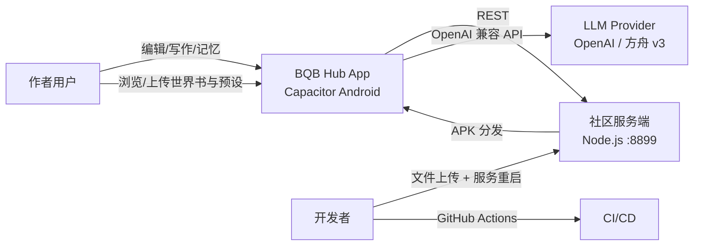
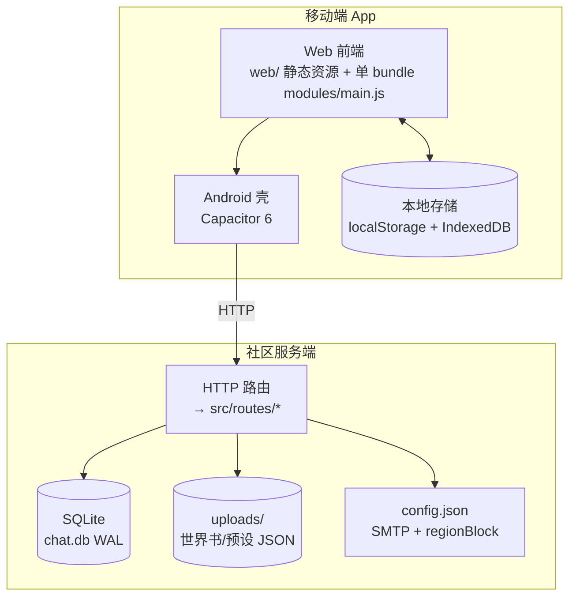

# BQB Hub 架构（C4）

> 目标形态（工程化进行中）。Level 1-2 为现状与目标混合描述，Level 3 标注当前实现。

## Level 1 · 系统上下文



## Level 2 · 容器



## Level 3 · 服务端组件（已重构，src/ 结构）

```text
server/src/
├── main.js          # 入口：http server + 启动日志
├── app.js           # Express 应用：中间件管线（CORS/请求日志/地区拦截/错误处理）
├── config.js        # 配置中心（SMTP、regionBlock、路径；env 覆盖）
├── db.js            # SQLite 初始化 + 幂等迁移
├── auth.js          # 密码哈希/会话 Token/输入校验/requireAuth 中间件
├── mailer.js        # nodemailer 封装（未配置时 SMTP_NOT_CONFIGURED）
├── region.js        # geoip-lite 大陆地区拦截（布尔开关）
├── tls.js           # HTTPS（自签证书；证书缺失静默跳过）
├── wbsearch.js      # 世界书检索（FTS5 / LIKE 降级）
├── ratelimit.js     # 限流器 + 空桶回收
├── adminpass.js     # 管理员口令校验（scrypt）
└── routes/          # auth / worldbook / preset / plugin / proxy / system
```

## 模块依赖与迁移状态

| 层 | 模块 | 状态 |
|---|---|---|
| 服务端 | src/* 11 个模块 + routes/* 4 个 | ✅ 已拆分，node:test 回归测试通过 |
| 前端 | 单 bundle `web/modules/main.js`（TS 源码在 `app/src`，由 `npm run sync:legacy` 生成） | ✅ 30/30 统一管线化 + 全库 strict 类型检查（无 @ts-nocheck）；usage/settingsync 已 import 化（P1）；4 个超大文件 app/ui/community/cardwriter 待拆分（F009）；vitest 588 例 |

## 关键设计决策

- **数据本地优先**：写作数据在 IndexedDB/localStorage，服务器只持有社区数据（用户/世界书/预设）。
- **SQLite + WAL**：node:sqlite 内置驱动，无外部服务；WAL 支持并发读。
- **地区限制布尔化**：`config.regionBlock` 一个开关控制请求拦截（见 ADR-0002）。
- **API 风格**：统一 JSON 错误体 `{error: string}`；未登录 401 / 越权 403 / 不存在 404。

## 部署拓扑（现状）

主机地址、端口与运维命令见本地文档 `docs/部署与提交流程.md`（**不入库**）。服务端目录结构：

```text
<部署根>/server
├── src/main.js            # 线上运行入口（systemd ExecStart 带 --experimental-sqlite）
├── routes/                # 路由层
├── app-version.json       # 版本分发源
├── apk/*.apk             # APK 文件（线上运行时目录，仓库不含）
├── data/chat.db           # SQLite
└── config.json            # SMTP + regionBlock（不入库）
```

> 2026-08 已完成线上切换（systemd ExecStart → src/main.js），旧单文件 index.js 已从仓库删除。